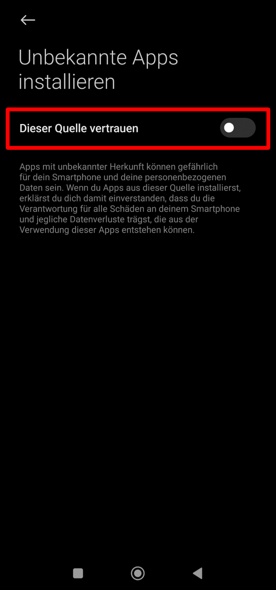

# Burgbichl - Beyond the Surface

XR technologies present unique solutions to communicate Cultural Heritage (CH) knowledge to broad audiences. They enhance CH conservation and education by creating engaging learning environments employing storytelling attributes (42.5%), active learning features (37.5%), and Serious Games concepts (35%). This research develops an outdoor AR prototype for the archaeological excavation site on Burgbichl in close cooperation with the team leading the archaeological intervention. The prototype allows users to become archaeologists and interactively explore the site. Playtesting on-site reveals the prototype's quality and usability.
 

The prototype offers two game versions:
1. **Full Version:** You have to be physically present at Burgbichl for it to work
2. **Test Version:** This version adapts to your current position and works from anywhere
 

### Install the Prototype to your Phone
1. Enable installing apps from unknown sources:
        (If you're having trouble, check the screenshots below)
   1. Go to **Settings > Security**
   2. Enable **"Install unknown apps"** for your browser
2. Follow the [download link](https://github.com/xlieA/Burgbichl_Prototype/releases/download/v0.1-beta.1/prototype.apk) in your browser or scan the QR code below
   

      
   

3. Tap **"Download"**
4. When finished, tap the file to install

> **Note**  
> Please make sure to give the app permission to access your smartphone's camera and your GPS location in your phone's settings:  
> **Settings > Apps > Prototype > Location/Camera**  
>  
> Select **“Allow only while using the app”**, since **“Ask every time”** may lead to issues on some smartphones.

 

   
   
   
   
   
   

## Gameplay Trailer

